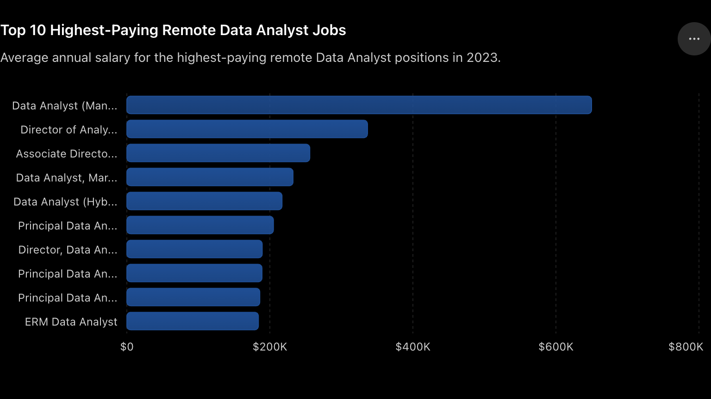

# 📊 SQL Data Job Market Analysis (2023)

This project analyzes the 2023 data job market using SQL to uncover insights into salaries, in-demand skills, and career opportunities. Through a series of analytical queries, I explored the highest-paying data jobs, the skills required for those roles, the most sought-after technologies, and which skills offer the best combination of high demand and strong salaries. The project demonstrates how SQL can be used to transform raw data into meaningful, data-driven insights.

SQL queries? Check them out here: [project_sql folder](/project_sql)


# Background
As the demand for data professionals continues to grow, understanding the job market has become increasingly important for job seekers and aspiring analysts. This project explores a 2023 dataset of data-related job postings to identify salary trends, in-demand skills, and the technologies that employers value most. By leveraging SQL to analyze the data, the project aims to provide actionable insights that can help guide career development and skill-building decisions.

# Tools I Used
This project was completed using the following tools:

- **SQL:** Used to query, filter, join, and analyze the job posting data.
- **Visual Studio Code:** Served as the primary code editor for writing and organizing SQL scripts.
- **PostgreSQL:** Managed the relational database and executed SQL queries efficiently.
- **Git & GitHub:** Used for version control and to document, track, and share the project.
# The Analysis

### 1. Top Paying Data Analyst Jobs

#### 🎯 Objective
Identify the highest-paying remote Data Analyst positions by analyzing job postings with disclosed salaries and ranking them by average annual salary.

#### SQL Query

```sql
SELECT 
    jpf.job_id,
    jpf.job_title_short AS job,
    jpf.job_title,
    jpf.job_location,
    jpf.job_schedule_type,
    jpf.salary_year_avg,
    jpf.job_posted_date,
    company_dim.name AS company_name
FROM 
    job_postings_fact AS jpf
LEFT JOIN company_dim
    ON company_dim.company_id = jpf.company_id
WHERE
    job_title_short = 'Data Analyst' AND
    job_location = 'Anywhere' AND
    salary_year_avg IS NOT NULL
ORDER BY
    salary_year_avg DESC
LIMIT 10
```

#### Visualization

*Bar graph visualizing the salary for the top 10 salaries for data analysts; ChatGPT generated this graph from my sql qeury result.*

#### 📊 Analysis

This query identifies the **10 highest-paying remote Data Analyst jobs** by filtering for positions with a specified annual salary and ordering them from highest to lowest compensation.

The results reveal a significant salary range, with the highest-paying position at **Mantys** offering an annual salary of **$650,000**—nearly double the next highest listing. While this appears to be an exceptional outlier, the remaining positions still offer salaries well above the average for data analysts, ranging from **$184,000 to $336,500**.

Another clear trend is that **senior and leadership roles** dominate the highest-paying positions. Titles such as **Director of Analytics**, **Associate Director**, and **Principal Data Analyst** appear repeatedly, indicating that organizations reward experience, leadership, and strategic decision-making with substantially higher compensation.

Finally, all of the jobs are listed as **remote ("Anywhere")**, demonstrating that remote work continues to provide access to premium-paying opportunities across industries including technology, healthcare, telecommunications, and finance.

#### 🔑 Key Insights

* 💰 The highest-paying remote Data Analyst role offers **$650,000** per year.
* 📈 Senior and leadership positions make up most of the highest-paying opportunities.
* 🌎 Every job in the top 10 is a **remote** position.
* 🏢 High salaries are available across multiple industries, not just technology.
* 🚀 Advancing into leadership or specialized analytics roles can significantly increase earning potential.


### 2. Skills Required for Top Paying Data Analyst Jobs

#### 🎯 Objective

Identify the technical skills most frequently required for the highest-paying remote Data Analyst positions by joining the top-paying jobs with their associated skills.

#### SQL Query

```sql
WITH top_paying_jobs AS (
    SELECT 
        jpf.job_id,
        jpf.job_title,
        jpf.salary_year_avg,
        company_dim.name AS company_name
    FROM 
        job_postings_fact AS jpf
    LEFT JOIN company_dim
        ON company_dim.company_id = jpf.company_id
    WHERE
        job_title_short = 'Data Analyst' AND
        job_location = 'Anywhere' AND
        salary_year_avg IS NOT NULL
    ORDER BY
        salary_year_avg DESC
    LIMIT 10
)

SELECT 
    top_paying_jobs.*,
    skills_dim.skills
FROM top_paying_jobs
INNER JOIN skills_job_dim ON skills_job_dim.job_id = top_paying_jobs.job_id
INNER JOIN skills_dim ON skills_dim.skill_id = skills_job_dim.skill_id
ORDER BY
    top_paying_jobs.salary_year_avg DESC;
```

#### Visualization

*Bar graph visualizing the required skills for top 10 salaries for data analysts; ChatGPT generated this graph from my sql qeury result.*

#### 📊 Analysis

The results show that **SQL** is the most frequently requested skill among the highest-paying Data Analyst positions, appearing in **8 of the top 10 jobs**. This reinforces SQL as the core technical skill for advanced analytics roles.

**Python** is the second most common skill, appearing in **7 postings**, highlighting the importance of programming for data manipulation, automation, and advanced analysis. **Tableau** ranks third, demonstrating that data visualization remains a critical competency even in senior-level analyst positions.

Beyond these core skills, employers frequently seek experience with **R**, **Excel**, and cloud platforms such as **Azure**, **AWS**, and **Snowflake**. Several postings also require big data tools like **Databricks** and **PySpark**, suggesting that organizations increasingly value analysts who can work with large-scale data pipelines and cloud-based analytics environments.

Overall, the highest-paying roles demand a combination of **database querying, programming, visualization, and cloud technologies**, rather than expertise in a single tool.

#### 🔑 Key Insights

* 🥇 **SQL** is the most essential skill, appearing in **8 of the top 10** highest-paying jobs.
* 🐍 **Python** is nearly as important, required in **7** top-paying positions.
* 📊 **Tableau** is the leading visualization tool, appearing in **6** postings.
* ☁️ Cloud platforms (**Azure, AWS, Snowflake**) are common requirements for high-paying analyst roles.
* 🚀 The highest salaries are associated with professionals who combine **SQL, Python, visualization tools, and cloud technologies**, rather than relying on a single technical skill.

### 3. Demand Skills for Data Analyst

#### 🎯 Objective

Identify the technical skills that appear most frequently in remote Data Analyst job postings to determine which skills are most sought after by employers.

#### SQL Query

```sql
SELECT
    skills_dim.skills skills,
    COUNT(*) demand_count
FROM skills_job_dim
INNER JOIN skills_dim ON skills_job_dim.skill_id = skills_dim.skill_id
INNER JOIN job_postings_fact jpf ON skills_job_dim.job_id = jpf.job_id
WHERE
    jpf.job_title_short = 'Data Analyst' AND
    jpf.job_location = 'Anywhere'
GROUP BY
    skills_dim.skills
ORDER BY
    demand_count DESC
LIMIT 5
```

#### Visualization

*Bar graph visualizing the top 5 demand skills for data analyst jobs; ChatGPT generated this graph from my sql qeury result.*

#### 📊 Analysis

This analysis identifies the **five most in-demand skills** for remote Data Analyst positions by counting how frequently each skill appears across job postings.

The results show that **SQL** is by far the most requested skill, appearing in **7,291** job postings. This confirms SQL as the foundational skill for data analysts, as it is essential for querying, managing, and analyzing relational databases.

**Excel** ranks second with **4,611** postings, demonstrating that spreadsheet analysis remains a valuable tool for reporting, business analysis, and ad hoc data exploration. **Python** closely follows with **4,330** postings, reflecting the growing demand for programming skills in data cleaning, automation, and advanced analytics.

Visualization tools are also highly valued, with **Tableau** appearing in **3,745** postings and **Power BI** in **2,609** postings. This highlights employers' emphasis on communicating insights effectively through dashboards and interactive reports.

#### 🔑 Key Insights

* 🥇 **SQL** is the most in-demand skill, appearing in **7,291** job postings.
* 📊 **Excel** remains highly relevant, ranking second despite the rise of modern analytics tools.
* 🐍 **Python** is one of the most valuable technical skills, reflecting the increasing need for automation and advanced analytics.
* 📈 **Tableau** and **Power BI** are the leading business intelligence tools, emphasizing the importance of data visualization.
* 🚀 A strong foundation in **SQL, Excel, Python, and visualization tools** provides the skill set most frequently requested by employers hiring Data Analysts.

### 4. Top Paying Skills of Data Analyst Jobs

#### 🎯 Objective

Identify which technical skills are associated with the highest average salaries for remote Data Analyst positions by calculating the average salary for each skill.

#### SQL Query

```sql id="d57v54"
SELECT
    skills_dim.skills skills,
    ROUND(AVG(jpf.salary_year_avg), 0) average_salary
FROM skills_job_dim
INNER JOIN skills_dim ON skills_job_dim.skill_id = skills_dim.skill_id
INNER JOIN job_postings_fact jpf ON skills_job_dim.job_id = jpf.job_id
WHERE
    jpf.job_title_short = 'Data Analyst' AND
    jpf.salary_year_avg IS NOT NULL AND
    jpf.job_work_from_home = TRUE
GROUP BY
    skills_dim.skills
ORDER BY
    average_salary DESC
LIMIT 25
```

#### Visualization

*Bar graph visualizing the top paying skills for data analyst jobs; ChatGPT generated this graph from my sql qeury result.*

#### 📊 Analysis

This analysis ranks the **highest-paying technical skills** based on the average salary of remote Data Analyst job postings that require them.

The results show that **PySpark** commands the highest average salary at **$208,172**, making it the most valuable skill in terms of compensation. Other high-paying technologies include **Bitbucket**, **Couchbase**, **Watson**, and **DataRobot**, all of which are associated with salaries exceeding **$150,000**.

Many of the highest-paying skills fall into categories such as **big data processing**, **machine learning**, **cloud computing**, and **data engineering**. Technologies like **PySpark**, **Databricks**, **Airflow**, and **Kubernetes** suggest that employers are willing to pay a premium for analysts who can work with large-scale data pipelines and modern cloud infrastructures.

Additionally, programming and analytical libraries such as **Pandas**, **NumPy**, and **Jupyter** appear among the top-paying skills, reinforcing the importance of Python-based data analysis for advanced analytics roles.

#### 🔑 Key Insights

* 💰 **PySpark** is the highest-paying skill, with an average salary of **$208,172**.
* ☁️ Big data and cloud technologies (**PySpark, Databricks, Airflow, Kubernetes**) are consistently associated with higher salaries.
* 🤖 Machine learning and AI tools such as **DataRobot**, **Watson**, and **Scikit-learn** command premium compensation.
* 🐍 Python libraries like **Pandas**, **NumPy**, and **Jupyter** are valuable skills for higher-paying analyst positions.
* 🚀 Analysts who expand beyond traditional reporting tools into **data engineering, cloud platforms, and machine learning** can significantly increase their earning potential.

> **Note:** Unlike the previous analysis, this section ranks skills by **average salary**, not by how frequently they appear in job postings. Some of these skills are relatively rare but command substantially higher salaries due to their specialized nature.

### 5. Optional Skills for Data Analyst Jobs

#### 🎯 Objective

Identify the most valuable skills for Data Analysts by combining **market demand** with **average salary**. This analysis highlights skills that are both frequently requested by employers and associated with higher-than-average compensation.

#### SQL Query

```sql id="p6y6fh"
WITH demand_skills AS (
    SELECT
        skills_job_dim.skill_id,
        skills_dim.skills skills,
        COUNT(skills_job_dim.job_id) demand_count
    FROM skills_job_dim
    INNER JOIN skills_dim ON skills_job_dim.skill_id = skills_dim.skill_id
    INNER JOIN job_postings_fact jpf ON skills_job_dim.job_id = jpf.job_id
    WHERE
        jpf.job_title_short = 'Data Analyst' AND
        jpf.salary_year_avg IS NOT NULL AND
        jpf.job_location = 'Anywhere'
    GROUP BY
        skills_job_dim.skill_id,
        skills_dim.skills
),
average_salary AS (
    SELECT
        skills_job_dim.skill_id,
        skills_dim.skills skills,
        ROUND(AVG(jpf.salary_year_avg), 0) avg_salary
    FROM skills_job_dim
    INNER JOIN skills_dim ON skills_job_dim.skill_id = skills_dim.skill_id
    INNER JOIN job_postings_fact jpf ON skills_job_dim.job_id = jpf.job_id
    WHERE
        jpf.job_title_short = 'Data Analyst' AND
        jpf.salary_year_avg IS NOT NULL AND
        jpf.job_work_from_home = TRUE
    GROUP BY
        skills_job_dim.skill_id,
        skills_dim.skills
)

SELECT
    demand_skills.skill_id,
    demand_skills.skills,
    demand_count,
    avg_salary
FROM demand_skills
INNER JOIN average_salary ON demand_skills.skill_id = average_salary.skill_id
WHERE
    demand_count > 10
ORDER BY
    avg_salary DESC,
    demand_count DESC
```

#### Visualization

*Bar graph visualizing the top optimal skills for data analyst jobs; ChatGPT generated this graph from my sql qeury result.*

#### 📊 Analysis

This analysis combines **salary** and **market demand** to identify the skills that provide the greatest career value for Data Analysts. Unlike the previous analyses, which focused solely on either salary or demand, this query highlights skills that strike the best balance between both.

The results show that **SQL** remains the most valuable foundational skill, appearing in **398** job postings while offering an average salary of **$97,237**. **Python** and **Tableau** also stand out, combining high demand with six-figure average salaries, making them excellent investments for aspiring and experienced data analysts alike.

Several cloud and big data technologies—including **Snowflake**, **Azure**, and **AWS**—offer even higher average salaries, although they appear in fewer job postings. These skills are highly specialized and can significantly boost earning potential for analysts looking to advance into data engineering or cloud-focused roles.

Overall, the findings suggest that developing a strong foundation in **SQL, Python, Tableau, and Power BI**, while gradually expanding into cloud platforms and big data technologies, provides the best balance between employability and salary growth.

#### 🔑 Key Insights

* ⭐ **SQL** offers the strongest combination of **high demand (398 postings)** and **competitive salary (~$97K)**.
* 🐍 **Python** is one of the best long-term investments, combining **high demand (236 postings)** with an average salary above **$100K**.
* 📊 **Tableau** and **Power BI** remain highly valuable visualization tools with strong market demand.
* ☁️ Specialized cloud technologies such as **Snowflake**, **Azure**, and **AWS** command some of the highest salaries, despite lower demand.
* 🚀 The best strategy for career growth is to master **core analytics skills (SQL, Python, Tableau)** before expanding into **cloud platforms, data engineering, and big data technologies** for higher earning potential.

# What I Learned

Working on this project strengthened both my **SQL proficiency** and my ability to extract meaningful insights from real-world data. Throughout the analysis, I gained hands-on experience with:

* **Writing complex SQL queries** using `JOIN`s, `CTE`s, aggregate functions, filtering, grouping, and sorting.
* **Combining data from multiple tables** to answer business-focused questions about salaries, skills, and job demand.
* **Transforming raw data into actionable insights** by analyzing trends rather than simply retrieving records.
* **Understanding the data analyst job market**, including which skills are most in demand, which command the highest salaries, and which offer the best balance between demand and earning potential.
* **Presenting findings effectively** through clear visualizations and concise analyses, making the results accessible to both technical and non-technical audiences.

This project reinforced that SQL is more than a querying language—it's a powerful tool for solving business problems and uncovering insights that support data-driven decision-making.

# Conclusions

This project demonstrates how SQL can be used to transform raw job posting data into meaningful, data-driven insights. By analyzing salary trends, skill demand, and the relationship between compensation and technical expertise, I identified the skills and career paths that offer the greatest opportunities for Data Analysts.

The analysis shows that **SQL** remains the most essential skill in the job market, while **Python**, **Tableau**, and cloud technologies such as **Snowflake**, **Azure**, and **AWS** provide strong opportunities for career growth and higher salaries. Overall, this project highlights the value of combining technical SQL skills with analytical thinking to answer real business questions and support informed career decisions in the data analytics field.
